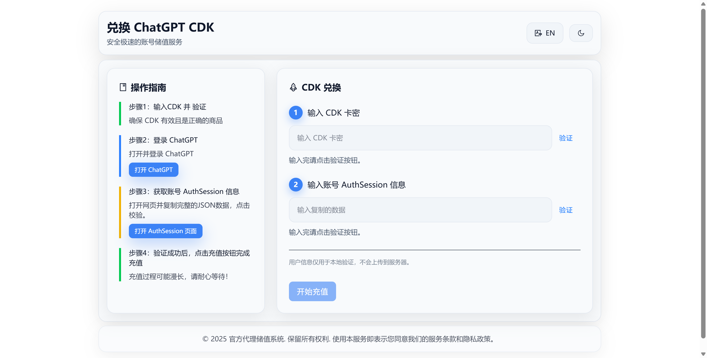
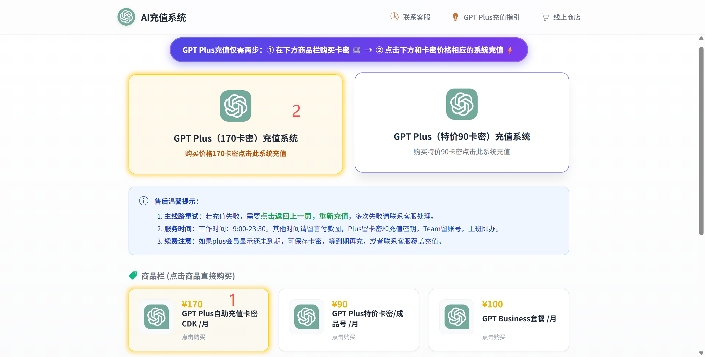

# 2026年国内最全最新 ChatGPT Plus 充值订阅攻略：从Google Play新渠道到信用卡风控的深度避坑指南 

都 2026 年了，想给 ChatGPT 充值订阅 Plus会员，怎么比还这么难？

如果你点进这篇文章，大概率是刚刚经历了一场令人抓狂的支付失败，正在气头上。

**以下场景是不是特别熟悉：**

- 兴冲冲地掏出自己常用的**招商银行 Visa/Mastercard 双币卡**，信息填得仔仔细细，梯子也挂了美国节点，结果点击订阅的那一秒——啪！一个刺眼的红框弹出来：`Your card has been declined`。
- 不信邪，花了一下午去研究什么 Depay、OneKey **虚拟卡**，好不容易搞定了 USDT 入金，多花了百分之十几的手续费，结果一绑卡，还是被拒。
- 甚至想试试 iOS **礼品卡**，去淘宝一看，又怕买到黑卡把自己的 Apple ID 给封了，一步一步提心吊胆，生怕操作有遗漏，最后还是卡在其中的一步功亏一篑。

**别怀疑自己，不是你操作有问题，而是现在的风控简直变态。**这就是一场针对国内用户的精准风控围剿。作为一个从 GPT-3.5 时代就被风控折磨过来的老程序员，我太懂这种“有钱花不出去”的憋屈感了。

为了解决这个问题，我把这两年测试过的所有路子——包括最新的 Google Play 渠道——彻底复盘了一遍。今天咱们不整虚头巴脑的理论，就讲目前**真正还能跑通的 4 种实操方案**，带你绕过这些坑，成功充值chatgpt plus会员。

### **省流版概括：2026年订阅充值chatgpt plus会员最新最全的四种方案，亲测可用！**

在 OpenAI 和 Stripe 联手升级的风控围剿下，市面上 90% 的老旧方法（如普通 Depay 卡段、随意注册的美区 ID）都已经失效。经过多轮实测，目前真正**靠谱、稳定且主流**的方案只剩下以下 4 种。

大家可以根据自己的设备条件和环境合理选择：

1. **Google Play 内购（新增）**：适合有 Android 备用机，且有折腾 GMS 框架能力的技术党。
2. **美区 Apple ID + 礼品卡**：iOS 用户的传统路径，门槛中等，但“黑卡”风险极高。
3. **虚拟信用卡（USDT 入金）**：适合币圈玩家，门槛极高，手续费磨损大，容易被 Stripe 拒付。
4. **国内代充服务**：适合追求效率、不想折腾环境、只需要结果的用户（含支付宝/微信直付）**。**

下面，我将逐一拆解这 4 种方案的具体操作步骤与核心避坑点。

### **方案一：Google Play 内购（2026 Android 用户新红利）**

这是最近半年才逐渐稳定下来的渠道。OpenAI 的 Android 版 App 开放了 Google Play 内购，看似给了大家一条活路，但门槛其实都在**手机环境**上。

**【操作步骤】**

1. **准备环境**：需要一台安装了完整 GMS（谷歌服务框架）的安卓机。**注意：** 国产手机（小米/华为等）如果经过深度定制或未通过 Play Integrity 验证，可能无法支付。
2. **账号准备**：注册一个全新的美区 Google 账号（全程挂美区 IP，不要绑定 +86 手机号）。
3. **绑定支付**：在 Google Play 中绑定一张支持美元支付的卡（如果没有外币卡，这步可能会卡住）。
4. **下载与订阅**：在 Play Store 下载官方 ChatGPT App，点击 Upgrade to Plus，走 Google 通道扣费。

**【避坑雷区】**

- **环境风控**：如果你使用模拟器，或者手机 Root 后没有隐藏好，App 会直接闪退或报错。
- **Google 风控**：Google 的风控代码（如 `OR_CCR_53`）非常玄学，一旦你的 IP 被识别为数据中心（Data Center）而非住宅 IP，账号会被立刻锁定。

### **方案二：美区 Apple ID + 礼品卡（iOS 用户必读）**

这是目前流传最广的方法，但也是**“账号被封”的重灾区**。

**【操作步骤】**

1. **注册美区 ID**：访问苹果官网，创建一个新的 Apple ID，国家选美国。
2. **设置免税州**：地址务必填写俄勒冈州（Oregon）或特拉华州（Delaware），邮编如 `97201`，否则每月多扣 $2 税费。
3. **购买礼品卡**：通过支付宝（切换旧金山）或美亚官网购买礼品卡。
4. **充值订阅**：在 App Store 登录新号，兑换卡密，下载 ChatGPT App 内购。

**【避坑雷区】**

- **黑卡陷阱**：淘宝/闲鱼上的低价礼品卡很多是盗刷信用卡得来的“黑卡”。一旦苹果追溯，轻则清空余额，重则直接封禁 Apple ID。
- **IP 跳变**：如果你的 IP 今天在洛杉矶，明天在纽约，Apple 会判定账号异常并锁死，且你无法提供美国身份证明来解封。

### **方案三：虚拟信用卡（硬核极客的最后防线）**

对于没有国外亲戚朋友，又想自己掌握支付权的人，这是唯一的“硬解”方案（如 Dupay, OneKey 等）。

**【操作步骤】**

1. **开户 KYC**：注册虚拟卡平台，上传身份证/护照进行实名认证。
2. **买币入金**：在欧易/币安用人民币购买 USDT，提现到虚拟卡钱包。
3. **货币兑换**：将 USDT 兑换为 USD（扣除损耗）。
4. **网页支付**：在 ChatGPT 网页端输入卡号支付。

**【避坑雷区】**

- **资金磨损惊人**：买币溢价 + 提币费 + 开卡费 + 月费 + 充值手续费，充值 $20 的实际成本往往接近 $30（约 220 元人民币）。
- **Stripe 卡段封杀**：这是最绝望的。你充好钱了，结果 OpenAI 提示 `Card Declined`，因为该虚拟卡的卡段（BIN）被 Stripe 批量拉黑了，钱直接烂在卡里。
- **跑路风险**：去年野卡Wildcard暂停服务事件还历历在目，后续陆续其他虚拟信用卡都不能用了，很多用户充值的余额没提出来，惨痛的回忆。

### **方案四：卡密代充服务（推荐：最省事方案）**

这么多年了，国内**gpt plus卡密代充**已经进化为一种成熟的chatgpt plus充值代充服务。对于只想用 AI 干活的用户，这是最省时省力的方案。

**【核心优势】**

1. 支付壁垒爆破（支付宝/微信直付）：
   不需要去搞虚拟币，不需要办外币卡。直接打开支付宝/微信扫码，30秒完成，就像在便利店买水一样简单。
2. 企业级渠道稳定性：
   不同于个人用的虚拟卡，正规服务商使用的是企业级主卡（Corporate Card）和银行白名单卡段，并且有足够多的卡片池，规避风控。这种卡在 OpenAI 的风控系统中权重极高，极少出现拒付或掉单。
3. 售后兜底：
   你自己折腾封了号，只能吃哑巴亏。找专业服务，有人工客服兜底。售前咨询+售后质保，并且是一个月一个月充，不用担心在线AI客服绕圈和跑路的问题。

**【操作步骤】**

主要的操作步骤其实就两步：

1. 支付宝扫码支付购买卡密
2. 复制购买的卡密+账号充值令牌信息进行充值

如图所示，具体步骤如下:

1. 输入卡密，验证卡密是否有效
2. 获取账号的充值令牌信息，验证令牌信息是否有效
3. 点击充值按钮，等待个1分钟不到chatgpt plus会员就充值成功了！

**【避坑雷区】**

- **价格陷阱：**官网成本20刀，折合人民币145，加上维护的费用，一般也得150左右，低于这个价格就得谨慎一点了，而有些200左右感觉溢价有点多了。

**总结：四种方案的最终权衡表**

为了帮你做出最终决定，我做了一个多维度的对比表：

| 维度     | 方案一：Google Play  | 方案二：iOS 礼品卡  | 方案三：虚拟信用卡   | 方案四：专业代充（推荐） |
| -------- | -------------------- | ------------------- | -------------------- | ------------------------ |
| 上手难度 | 困难（需特定安卓机） | 中等（需美区 ID）   | 极难（需懂加密货币） | 极简（有手就行）         |
| 支付方式 | 双币卡/PayPal        | 购买礼品卡          | USDT 兑换            | 支付宝 / 微信            |
| 资金成本 | 原价                 | 略有溢价            | 极高（含各种手续费） | 合理溢价（含服务费）     |
| 时间成本 | 3-5 小时             | 1-2 小时            | 3 小时+              | < 5 分钟                 |
| 封号风险 | 中（受谷歌风控影响） | 高（受黑卡/IP影响） | 中（受卡段风控影响） | 低（企业级渠道）         |
| 售后服务 | 无                   | 无                  | 无                   | 人工客服兜底             |

### **写在最后**

文章写到这里，总结一下几种的方案的适配人群。

前三种方法（谷歌内购、美区ID、虚拟卡），推荐给有时间、爱折腾的技术党去试试的。毕竟，亲自攻克 OpenAI 和 Stripe 的风控系统，除了成本和官网一致，搞定之后的成就感确实还是挺爽的。

但如果你和我一样，每天要靠 GPT写代码、改文案、做技术研究，实在经不起折腾，也不想因为忘了续费导致工作中断，那么——**听我一句劝，别走弯路。**

在踩坑了无数家代充、甚至遇到过跑路的服务商后，我现在自己用的，以及推荐给我身边同事的，都是下面这个**全自动**的渠道。

**传送门：[自助充值系统](https://gpt-bingo.top/)**

**为什么推荐这个？** 这也是我折腾这么多支付方式之后的结论，就图它三点：

1. **真的便宜**：相比那些动不动收 50% 手续费的平台，这家的价格是我目前见过最良心的，基本接近成本价。
2. **操作极简**：完全不需要像以前那样还要加客服微信、发转账截图、等人工回话。全程自助，支付宝扫个码，卡密自动发货，整个过程不到 2 分钟。
3. **亲测稳定**：我自己这个号已经稳用了大半年，中间没出过一次掉单。

在 2026 年，最贵的永远不是那点服务费，而是你为了省钱去折腾支付环境，最后却浪费了一下午宝贵的工作时间。

好用的工具就在这了，希望能帮你省下买止痛药的钱，把精力留给 Prompt 和创造吧。
